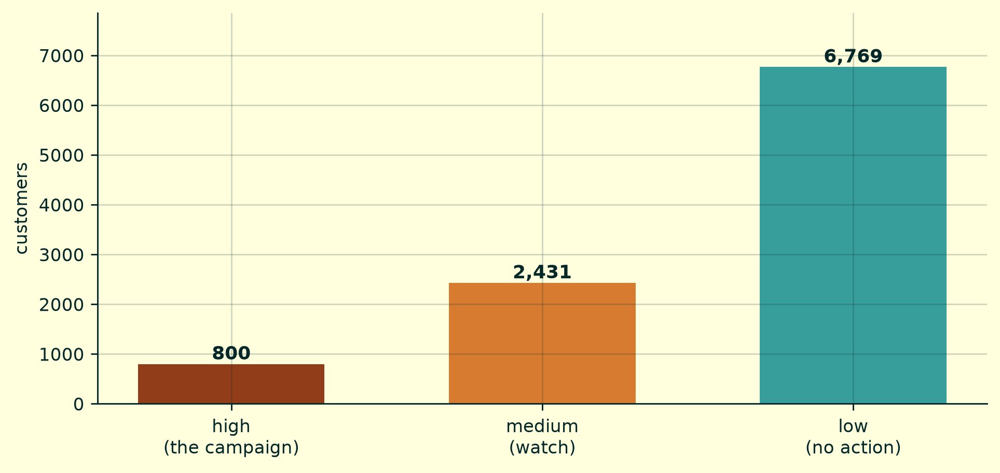
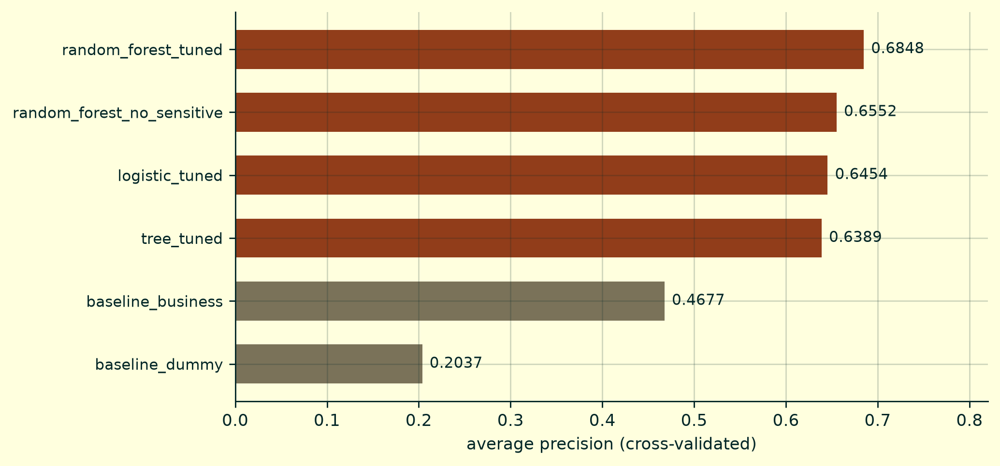
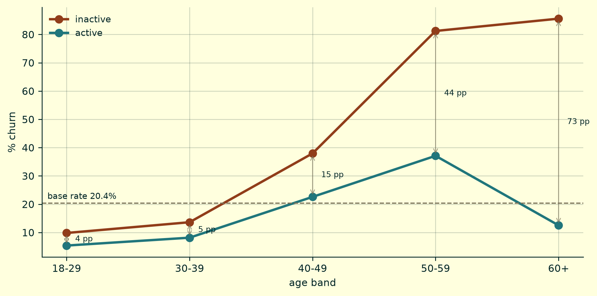
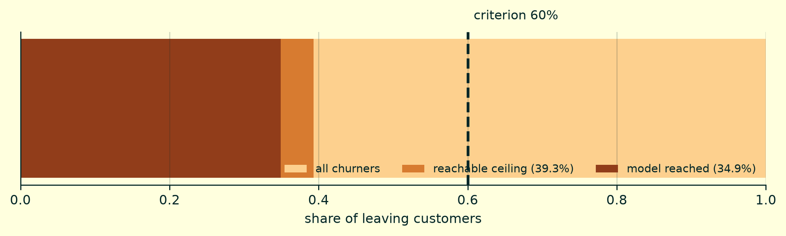

# Bank Customer Churn

**Ranking a customer portfolio when you can only call 800 of them.**

An end-to-end churn system on Databricks: a Postgres operational database, a
bronze/silver/gold Delta architecture, a calibrated model tracked in MLflow, and
a retention dashboard the campaigns team can actually use.

📊 **[Project site](https://UshioJuzo.github.io/bank-churn-databricks/)** ·
🚀 **[Live dashboard](https://bank-churn-databricks.streamlit.app/)**

---

## The problem

A bank loses one customer in five every year and has budget to call 800 before
they go. The question is not *who will leave* — nobody decides that. It is **who
to call with the calls you have**.

Recovering a customer is worth 145 €; bothering one who was staying costs 35 €.
From those two numbers a threshold falls out:

```
p* = 35 / (145 + 35) = 0.194
```

Below that, calling destroys value. But with fixed capacity the threshold that
applies is not the profitable one — it is the one the quota imposes. The 800
highest-risk customers go in, and the cut lands at 0.73.

**Capacity turns classification into ranking.** Everything downstream follows
from that: the metric is average precision rather than accuracy, the rival is a
business rule rather than random guessing, and there is a ceiling the project
could not cross.



## Results

Measured on a test set held out before any hyperparameter was tuned.

| | Model | Business rule |
|---|---|---|
| Average precision (cross-validated) | **0.6848** | 0.4677 |
| ROC-AUC | 0.8562 | 0.7526 |
| Precision at the operating threshold | **88.2 %** | — |
| Churners caught within the quota | 142 of 407 | 106 |
| Campaign value | **+19,925 €** | — |



The comparison that matters is not against chance. `baseline_business` is a
two-variable rule — inactive and over 50 — that the bank could apply tomorrow
with no model at all. If a tuned random forest does not clearly beat that, the
project does not justify its cost.

## The finding that changed the conclusion

Exploration first established that churn risk describes an inverted U across age.
**That turned out to be a composition artefact.**



Split by activity, the picture is different: among **inactive** customers risk
never stops climbing, reaching 85.6 % past 60. Among active ones it does fall.
The aggregate curve only bends because the share of active customers changes
across age bands.

Two consequences, and both are decisions rather than observations. A model that
treats age additively cannot represent this — an argument for trees over linear
models, made from the data. And the highest-risk cell in the dataset is *inactive
and over 60*, where **activity is the one variable the bank can actually change**.

## Two criteria that were not met

Eight criteria were registered before any model was trained. Six were met. The
two that failed are reported as failures, and neither was adjusted afterwards.



The recall criterion asked for 0.60. It was **impossible from the start**: with
160 contacts against 407 churners, no model — not even a perfect oracle — can
exceed 0.393. The model reached 0.349, which is **88.8 % of the maximum**.

The other failure is a 20.1-point recall gap between countries. That is not a
bug: it is the consequence of one global threshold applied to groups with
different base rates. Equalising it was priced at roughly 720 € per campaign.
Equalising recall across groups with different base rates is mathematically
incompatible with holding other desirable properties at once, so the project does
not promise a fair system — it measures the gap, prices it, and leaves the
decision with the business.

## Architecture

```
Volume ─▶ Lakebase ─▶ bronze ─▶ silver ─▶ model ─▶ gold ─▶ Lakebase ─▶ CRM
  CSV      Postgres      Delta     Delta            Delta   reverse ETL
                                                        └─▶ parquet ─▶ public app
```

**Lakebase** (Postgres 17 inside Databricks) is the operational side: single rows,
foreign keys, low latency. **Delta under Unity Catalog** is the analytical side:
columns, history, time travel. Two engines because they solve two different
problems — and because an analytical scan over the transactional database would
compete with the writes of the system that depends on it.

The predictions travel **back** to Postgres. A model whose output never reaches
the system that makes the decision has not finished.

Three rules the layers keep:

- `bronze` — the source unchanged. Nothing is corrected here.
- `silver` — only **deterministic** features. Anything that learns a statistic
  lives inside the sklearn `Pipeline`, fitted after the split. That is the
  anti-leakage control.
- `gold` — **one writer per table**, no exceptions. Learned the hard way, when two
  notebooks writing the same table broke the application days later.

## Structure

```
notebooks/
├── setup.ipynb                  Environment, branch, catalog, volume
├── 00_problem_definition.ipynb  Cost model, metrics, eight pre-registered criteria
├── 01_data_ingestion.ipynb      Volume → Lakebase → bronze, eight quality checks
├── 02_data_preparation.ipynb    Silver, deterministic features, decisions argued
├── 03_eda_analysis.ipynb        The thesis, the interaction, chi-squared and Mann-Whitney
├── 04_modeling.ipynb            Three families, CV, permutation importance, MLflow
├── 05_evaluation.ipynb          Test, calibration, bias, the two failed criteria
└── 06_gold_publication.ipynb    Gold, reverse ETL, Unity Catalog, public snapshot

src/config.py       shared bootstrap: connection, resource names, cost model
sql/                Lakebase schema — landing, modelled, grants, teardown
app/                Streamlit dashboard
site/               Quarto source for the project site
data/               the snapshot the public app reads
tools/              output sanitiser, run before every commit
```

## Reproducing it

Requires a Databricks account with Lakebase enabled, and a profile in
`~/.databrickscfg`.

```bash
pip install -r requirements.txt
cp .env.example .env          # then set DATABRICKS_PROFILE
```

Run `sql/01_landing.sql` in the Lakebase SQL editor, then the notebooks in this
order:

```
setup → 01 → 02 → 00 → 03 → 04 → 05 → 06
```

`00` runs after `02` because its business baseline reads from silver. That
ordering is deliberate and explained in the notebook: exploration informs the
framing, but **no model has been trained** when the acceptance criteria are fixed.

The dashboard needs none of that:

```bash
pip install -r app/requirements.txt
streamlit run app/streamlit_app.py
```

## Limitations, declared

**The dataset is synthetic, and the project proves it** rather than assuming it.
Four independent signs, none of them looked for on purpose: salary with the exact
skew and kurtosis of a uniform distribution, age and tenure correlating at −0.01,
all sixty customers with four products churning, and no outlier possible in salary
by construction. That places a ceiling on what any model can learn here.

**There is no time dimension.** With no churn date, the model estimates a
propensity, not a risk over a period. It cannot say "within three months".

**Germany is not explainable with this data.** It doubles the churn rate while
being indistinguishable on every observable variable, so `geography` acts as a
proxy for something unmeasured. The same is true of gender — which is why the
deployed model does not use it.

## Stack

Databricks (Lakebase Postgres 17, Unity Catalog, Delta Lake, MLflow) ·
Databricks Connect · Python (scikit-learn, pandas, PySpark) · Streamlit · Quarto

## Licence

MIT
